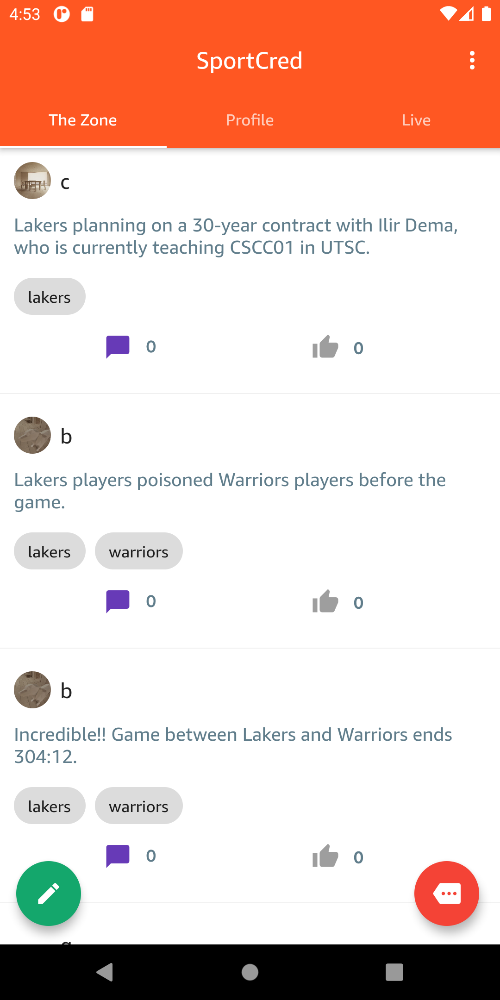
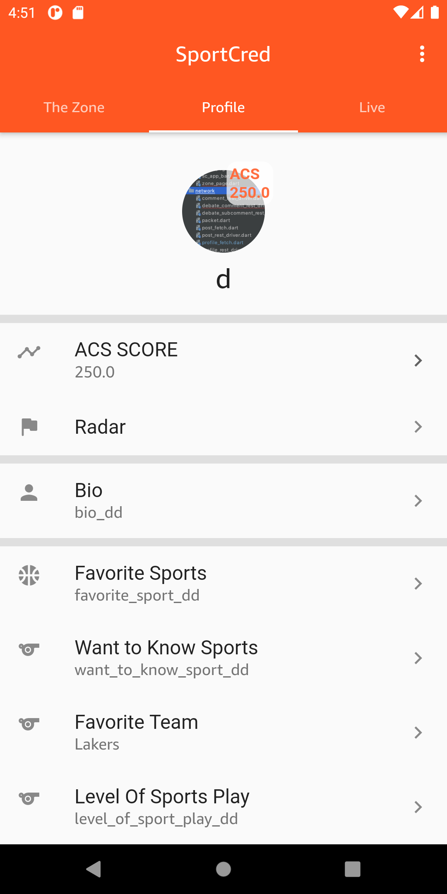

  

  Welcome to sportcred, a networking app for sports fans. In sportcred, you could contribute you sports knowledge to the community.

## Technologies Used
* [Flutter](https://flutter.dev/)
    * [Shared Preference](https://pub.dev/packages/shared_preferences)
    * [Photo View](https://pub.dev/packages/photo_view)
* [Firebase](https://firebase.google.com/)
* [Spring Boot](https://spring.io/projects/spring-boot)
* [MariaDB](https://mariadb.org/)
* [Google Cloud Service](https://cloud.google.com/)

## Features

### Sign In & Sign Up

### Show Posts

### Profile

### Reply Post

### Trivia Game (Solo & Multiplayer)

## Contributors

* [Ziheng Zhuang](https://github.com/NeoClear)
* [Xuduo Gu](https://github.com/XGsombra)
* [Quanhong Liu](https://github.com/LQH-is-newbe)
* [Wentao Jiang](https://github.com/SkyWentaoJiang)
* [Jiasheng Ye](https://github.com/yanjs)
* [Leke Ping](https://github.com/lkpklkk)
